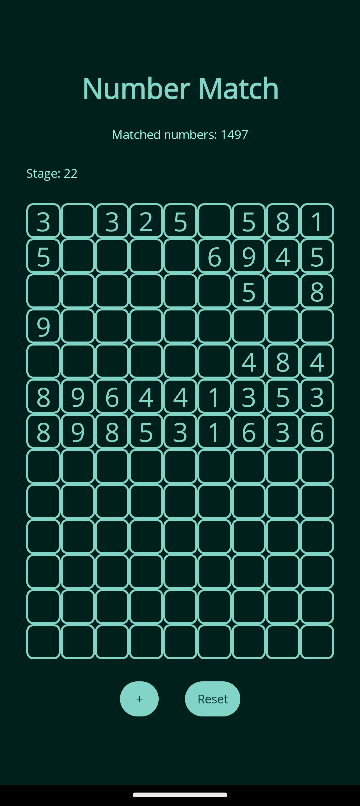

# Number Match

**Number Match** is a simple and engaging number matching game designed for both mobile and PC platforms. Built using C# and .NET MAUI, this app leverages material design principles and dynamic material colors to provide a visually appealing and user-friendly experience.



## Features

- **Dynamic Material Design**: The app uses dynamic material colors to adapt to the wallpaper colors and provide a consistent look and feel.
- **Cross-Platform**: Available on both mobile and PC platforms, ensuring a seamless experience across devices.
- **Engaging Gameplay**: Match numbers to clear the grid and advance through stages.
- **Haptic Feedback**: Provides tactile feedback to enhance the user experience.

## Getting Started

### Prerequisites

- [.NET MAUI](https://dotnet.microsoft.com/apps/maui)
- [Visual Studio](https://visualstudio.microsoft.com/) with .NET MAUI workload installed

### Installation

1. Clone the repository:
    ```sh
    git clone https://github.com/Jani-Aelterman-HoGent/NumberMatch.git
    ```
2. Open the solution in Visual Studio.
3. Restore the NuGet packages:
    ```sh
    dotnet restore
    ```
4. Build and run the project on your preferred platform (Android, iOS, Windows, etc.).

## Usage

- **Start a Game**:  start by simply opening the app.
- **Match Numbers**: Click on two numbers that either match or add up to 10 to clear them from the grid.
- **Advance Stages**: Clear all numbers from the grid to advance to the next stage.
- **Settings**: Customize the app settings by clicking the Logo.

## Contributing

Contributions are welcome! Please follow these steps to contribute:

1. Fork the repository.
2. Create a new branch:
    ```sh
    git checkout -b feature/your-feature-name
    ```
3. Make your changes and commit them:
    ```sh
    git commit -m "Add some feature"
    ```
4. Push to the branch:
    ```sh
    git push origin feature/your-feature-name
    ```
5. Open a pull request.

## License

This project is licensed under the MIT License. See the [LICENSE](LICENSE) file for details.

## Acknowledgements

- [Material Design](https://material.io/design)
- [CommunityToolkit.Maui](https://github.com/CommunityToolkit/Maui)
- [Newtonsoft.Json](https://www.newtonsoft.com/json)

> Made by Jani Aelterman